# Panduan Penggunaan LB AUTO untuk Pengguna

Dokumen ini merupakan panduan operasional aplikasi LB AUTO untuk tim showroom. Panduan disusun tanpa pembahasan instalasi atau konfigurasi teknis.

## 1. Tujuan aplikasi

Aplikasi LB AUTO digunakan untuk memantau perjalanan kendaraan secara teratur, mulai dari:

1. Pencatatan unit dari seller.
2. Pemeriksaan awal dan legalitas.
3. Inspeksi kendaraan.
4. Persetujuan pembelian dan pembayaran.
5. Repair dan pemeriksaan dokumen.
6. Listing dan penjualan.
7. Penjadwalan hingga penyelesaian delivery.

Setiap pengguna hanya melihat tindakan yang sesuai dengan tanggung jawabnya. Karena itu, tombol yang tersedia dapat berbeda antara satu akun dan akun lainnya.

## 2. Masuk ke aplikasi

1. Buka alamat aplikasi LB AUTO yang diberikan oleh administrator.
2. Masukkan email dan password akun Anda.
3. Tekan **Masuk ke sistem**.
4. Setelah berhasil, aplikasi akan membuka halaman **Home**.

Jangan membagikan password akun pribadi kepada pengguna lain. Gunakan akun sesuai role agar riwayat pekerjaan dapat diketahui dengan jelas.

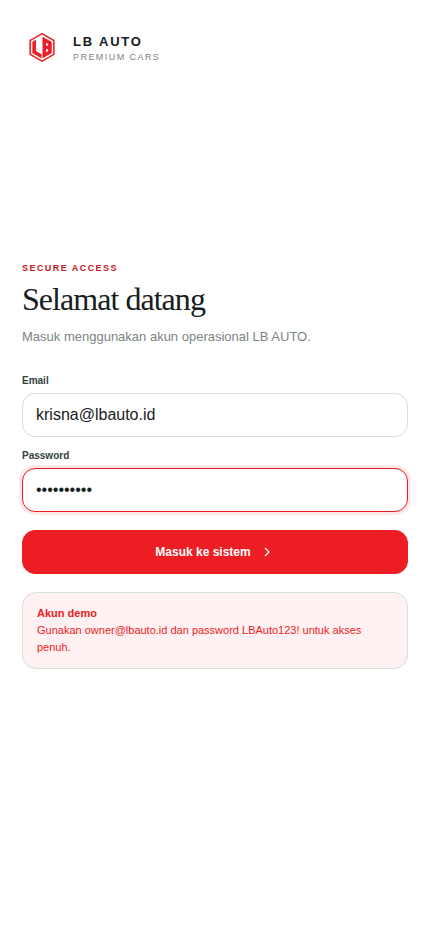

## 3. Akun demo

Semua akun demo menggunakan password berikut:

```text
LBAuto123!
```

| Role | Email | Tugas utama |
| --- | --- | --- |
| Owner | `owner@lbauto.id` | Memantau seluruh proses dan mengelola pengguna |
| PIC Pembelian | `krisna@lbauto.id` | Input unit, voucher, dan pembayaran |
| Inspection Leader | `ciprut@lbauto.id` | Initial QC dan penugasan checker |
| PIC Legal | `legal@lbauto.id` | Pemeriksaan legal dan dokumen |
| Field Checker | `checker@lbauto.id` | Inspeksi fisik kendaraan |
| Head of Department | `hod@lbauto.id` | Persetujuan pembelian dan Repair QC |
| PIC Workshop | `workshop@lbauto.id` | Serah-terima dan pekerjaan repair |
| Sales & Marketing | `sales@lbauto.id` | Listing, customer, transaksi, dan delivery |

Untuk penggunaan sebenarnya, administrator dapat memberikan akun dan password yang berbeda.

## 4. Mengenal tampilan aplikasi

### Home

Home menampilkan ringkasan unit, komposisi stok, aktivitas terbaru, agenda, dan kumpulan menu sesuai hak akses pengguna.

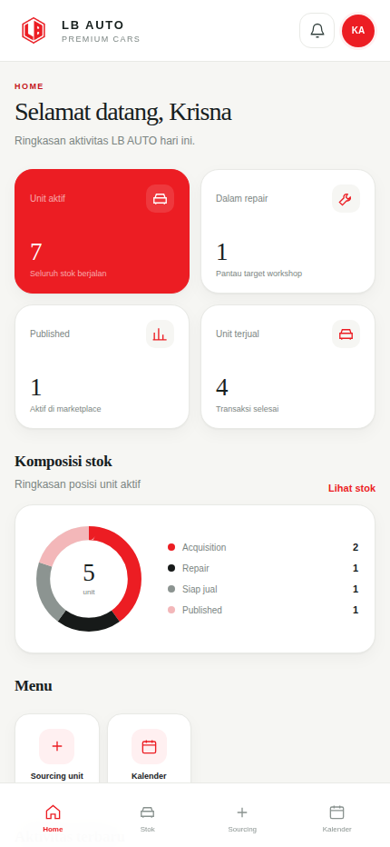

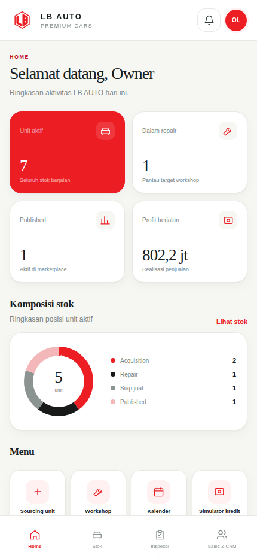

### Navigasi bawah pada mobile

Navigasi bawah menampilkan empat menu yang disesuaikan dengan role pengguna:

| Role | Menu pada navigasi bawah |
| --- | --- |
| Owner | Home, Stok, Inspeksi, Sales & CRM |
| PIC Pembelian | Home, Stok, Sourcing, Kalender |
| Inspection Leader | Home, Stok, Inspeksi, Kalender |
| PIC Legal | Home, Stok, Inspeksi, Workshop |
| Field Checker | Home, Stok, Inspeksi, Kalender |
| Head of Department | Home, Stok, Inspeksi, Workshop |
| PIC Workshop | Home, Stok, Workshop, Kalender |
| Sales & Marketing | Home, Stok, Sales & CRM, Simulator |

Menu hanya ditampilkan kepada role yang mempunyai akses. Menu operasional tambahan tersedia pada bagian **Menu** di Home dan sidebar desktop sesuai hak akses pengguna.

### Membuka Sourcing

Sourcing tersedia untuk PIC Pembelian. Untuk membukanya:

1. Tekan **Sourcing** pada navigasi bawah mobile; atau
2. Buka **Home**, cari bagian **Menu**, lalu pilih **Sourcing unit**.

Pada desktop, Sourcing tersedia pada sidebar.

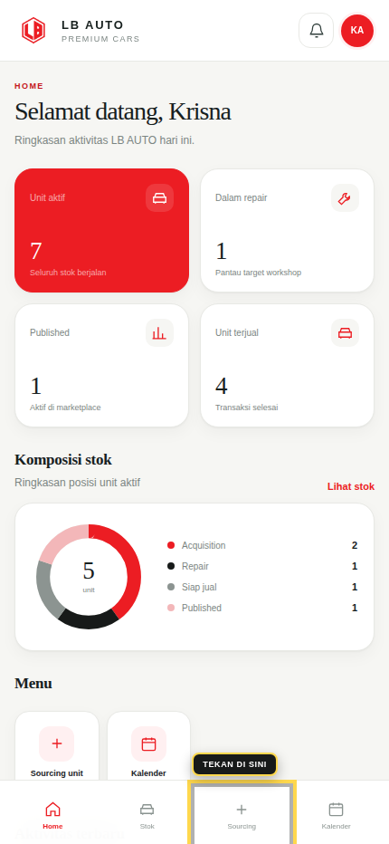

### Tugas pada menu Inspeksi

Menu Inspeksi menampilkan antrean yang menjadi tanggung jawab masing-masing role:

- **Inspection Leader**: unit untuk Initial QC dan penugasan Field Checker.
- **PIC Legal**: unit yang memerlukan pemeriksaan legal awal.
- **Field Checker**: unit yang ditugaskan kepada akun checker tersebut.
- **Head of Department**: laporan inspeksi yang menunggu keputusan pembelian.
- **Owner**: seluruh tugas inspeksi dan approval yang aktif.

Jika tidak ada tugas untuk role tersebut, halaman menampilkan keterangan bahwa antrean sedang kosong.

### Stok

Menu Stok menampilkan seluruh kendaraan. Gunakan pencarian atau pilihan status untuk menemukan unit tertentu, kemudian tekan kartu kendaraan untuk membuka detail.

### Detail unit

Detail unit berisi informasi kendaraan, status saat ini, tombol tindakan, serta tab:

- **Overview**
- **Inspeksi**
- **Repair**
- **Dokumen**
- **Media**

Tombol tindakan hanya muncul jika role pengguna dan status unit memang mengizinkan tindakan tersebut.

## 5. Ringkasan perjalanan unit

Secara umum, setiap unit melewati urutan berikut:

```text
Sourcing
→ Initial QC
→ Pemeriksaan Legal
→ Penugasan Checker
→ Inspeksi
→ Keputusan HOD
→ Pembayaran
→ Serah-terima Workshop
→ Repair
→ Repair QC
→ Document QC
→ Siap Jual
→ Listing
→ Booking
→ Pembayaran Cash atau Finance
→ Deal
→ Jadwal Delivery
→ Selesai Diserahkan
```

Tahap tidak dapat dilewati. Selesaikan tindakan yang sedang tersedia sebelum unit dapat berpindah ke tahap berikutnya.

## 6. Tahap 1 — Mencatat unit baru

Dilakukan oleh **PIC Pembelian**.

1. Masuk menggunakan akun PIC Pembelian.
2. Tekan **Sourcing** pada navigasi bawah mobile. Sourcing juga dapat dibuka dari bagian **Menu** di Home atau sidebar desktop.
3. Buka formulir pencatatan unit.
4. Isi sumber unit dan data penjual.
5. Isi identitas kendaraan, seperti merek, tipe, tahun, warna, nomor polisi, dan odometer.
6. Isi harga penawaran dan target harga.
7. Pada bagian **Foto cover unit**, tekan **Pilih foto**.
8. Pilih satu foto utama dari galeri, kamera, atau aplikasi file.
9. Tekan **Simpan unit**.

Foto cover merupakan foto utama yang muncul pada kartu Stok dan detail unit. Foto cover terpisah dari delapan foto inspeksi.

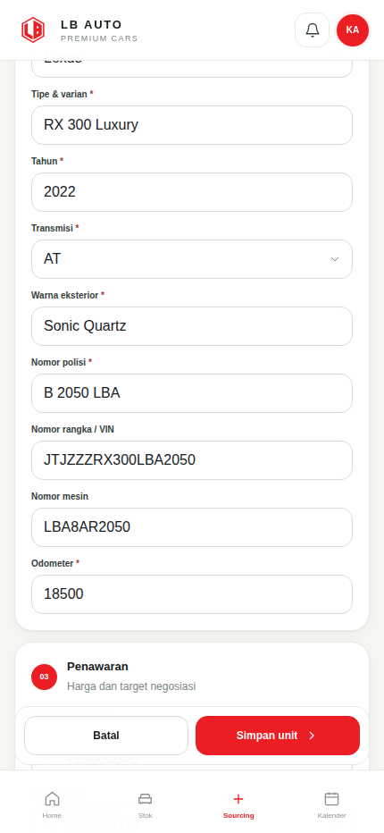

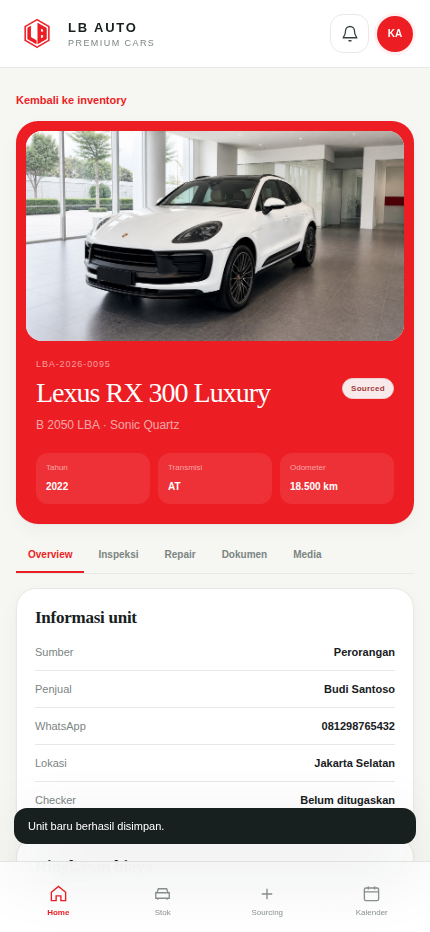

## 7. Tahap 2 — Initial QC

Dilakukan oleh **Inspection Leader**.

1. Masuk menggunakan akun Inspection Leader.
2. Buka menu **Inspeksi**.
3. Pilih unit berstatus **Sourced**.
4. Tekan **Initial QC**.
5. Pilih hasil pemeriksaan.
6. Isi catatan jika diperlukan.
7. Simpan hasil QC.

Jika unit lolos, proses dilanjutkan kepada PIC Legal. Jika unit ditolak, perjalanan unit berhenti.

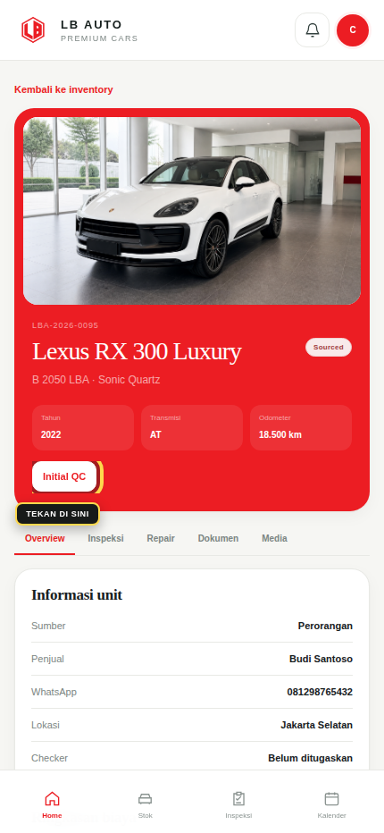

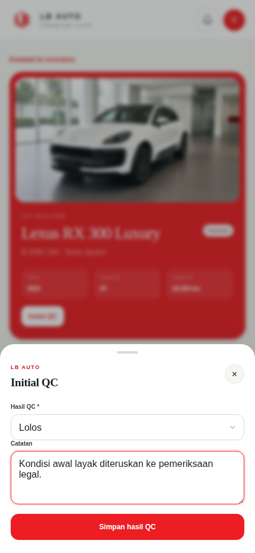

## 8. Tahap 3 — Pemeriksaan legal awal

Dilakukan oleh **PIC Legal**.

1. Masuk menggunakan akun PIC Legal.
2. Buka **Inspeksi**.
3. Pilih unit berstatus **Initial QC**.
4. Tekan **Pemeriksaan legal**.
5. Periksa ketersediaan STNK dan BPKB.
6. Pastikan nomor rangka serta nomor mesin sesuai.
7. Pastikan pajak sudah diperiksa.
8. Tambahkan catatan jika diperlukan.
9. Loloskan pemeriksaan legal.

Seluruh poin harus terpenuhi sebelum unit dapat ditugaskan kepada checker.

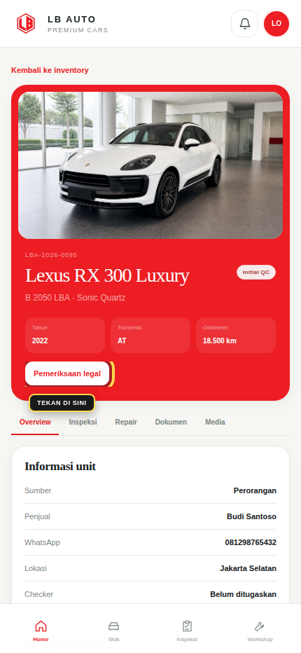

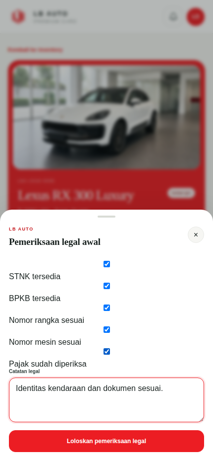

## 9. Tahap 4 — Menugaskan checker

Dilakukan oleh **Inspection Leader**.

1. Buka unit berstatus **Legal cleared**.
2. Tekan **Tugaskan checker**.
3. Pilih Field Checker.
4. Simpan penugasan.

Setelah ditugaskan, unit akan muncul pada antrean checker yang dipilih.

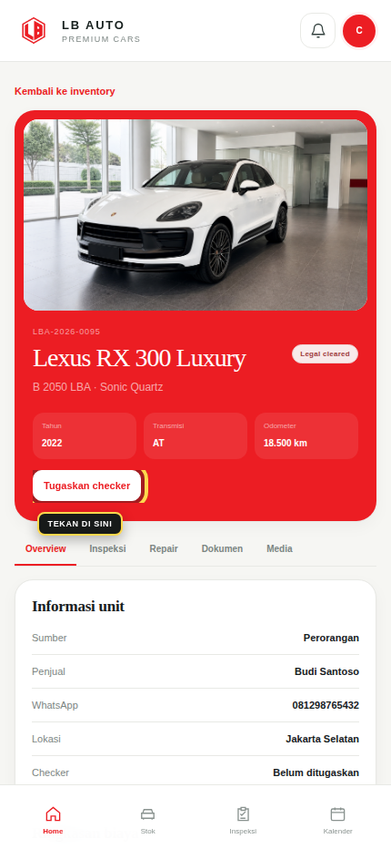

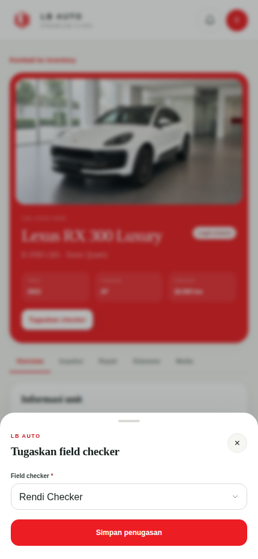

## 10. Tahap 5 — Mengisi inspeksi kendaraan

Dilakukan oleh **Field Checker**.

1. Masuk menggunakan akun Field Checker.
2. Buka **Inspeksi**.
3. Pilih unit yang ditugaskan.
4. Tekan **Isi inspeksi**.
5. Isi skor kondisi body.
6. Isi kondisi mesin, oli, kaki-kaki, indikasi tabrak, indikasi banjir, dan status pajak.
7. Isi catatan pemeriksaan.
8. Unggah tepat delapan foto pada tempat yang sesuai:
   - Depan.
   - Belakang.
   - Sisi kanan.
   - Sisi kiri.
   - Ruang mesin.
   - Interior.
   - Nomor rangka.
   - Odometer.
9. Tekan **Kirim laporan**.

Untuk setiap foto, tekan kartu **Pilih foto**. Perangkat akan menawarkan pilihan dari galeri, kamera, atau aplikasi file.

Jangan menggunakan foto cover sebagai salah satu foto inspeksi.

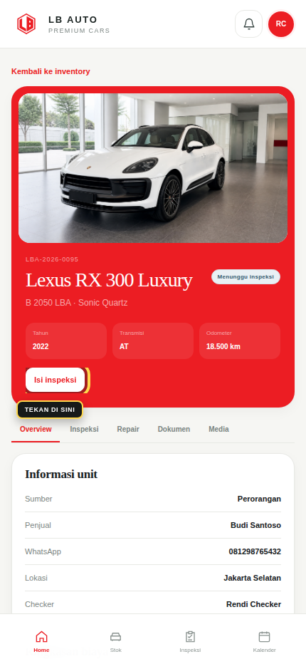

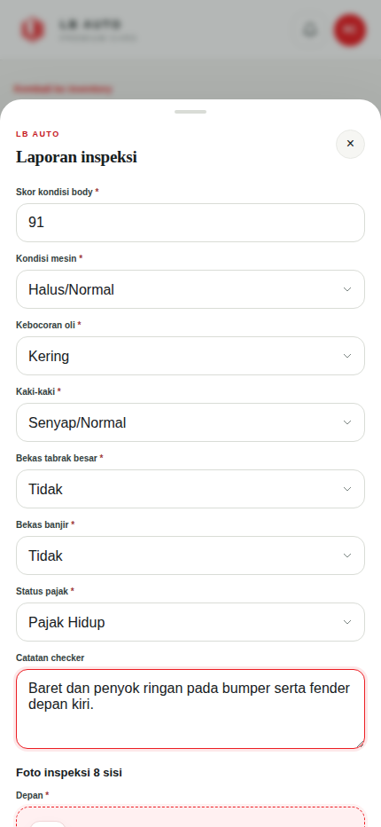

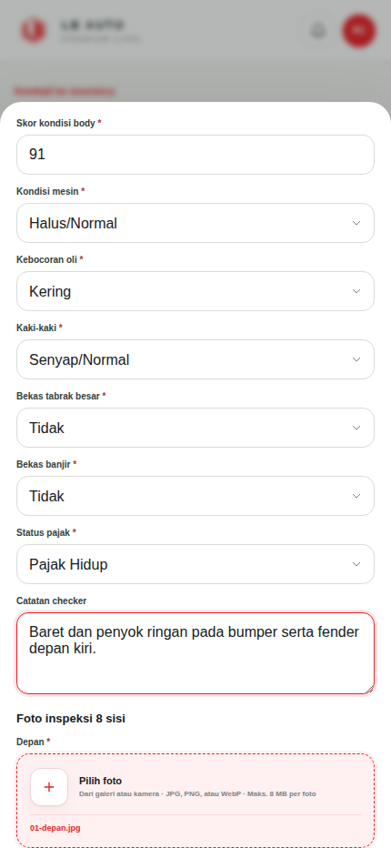

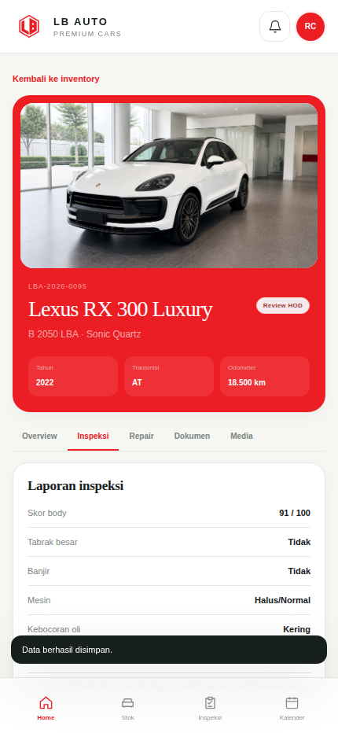

## 11. Tahap 6 — Keputusan pembelian

Dilakukan oleh **Head of Department**.

1. Buka unit berstatus **Review HOD**.
2. Periksa hasil pada tab Inspeksi.
3. Tekan **Keputusan HOD**.
4. Pilih untuk membeli atau menolak unit.
5. Jika membeli, isi harga pembelian final.
6. Jika menolak, isi alasan penolakan.
7. Konfirmasi keputusan.

Unit yang disetujui akan diteruskan kepada PIC Pembelian untuk pembayaran.

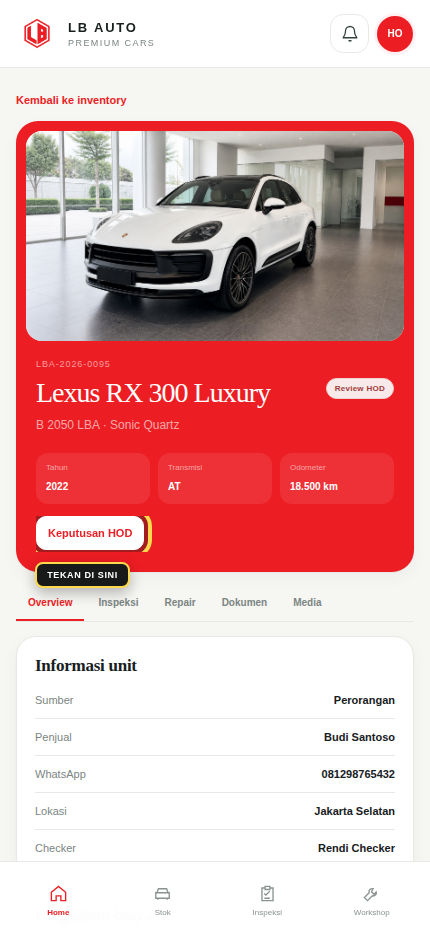

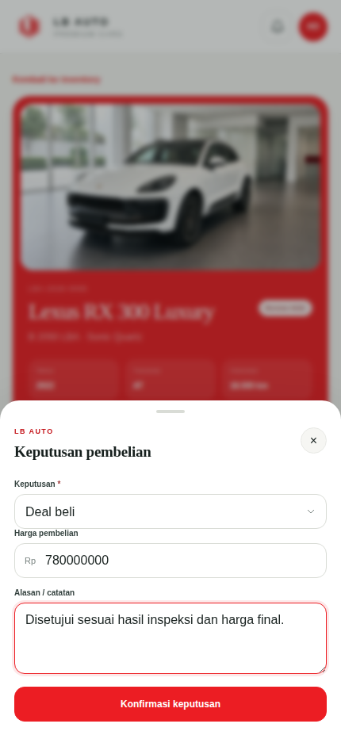

## 12. Tahap 7 — Voucher dan pembayaran

Dilakukan oleh **PIC Pembelian**.

### Membuat voucher

1. Buka unit berstatus **Disetujui HOD**.
2. Tekan **Buat voucher**.
3. Isi nomor voucher.
4. Isi nominal sesuai harga yang telah disetujui.
5. Pilih metode pembayaran.
6. Ajukan pembayaran.


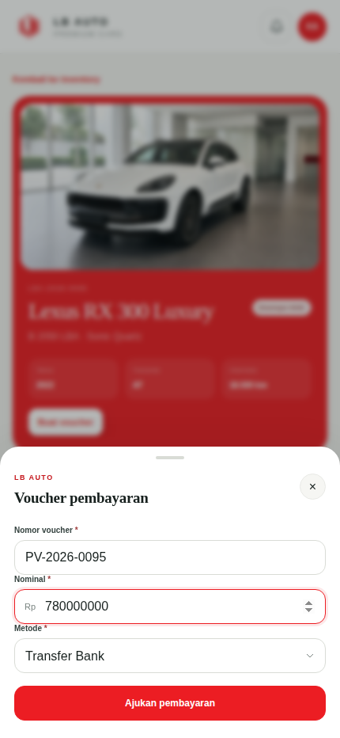

### Mengonfirmasi pembayaran

1. Buka unit berstatus **Menunggu pembayaran**.
2. Tekan **Konfirmasi pembayaran**.
3. Tekan **Pilih foto** dan unggah bukti pembayaran.
4. Isi waktu pembayaran jika diperlukan.
5. Konfirmasi bahwa pembayaran telah dilakukan.

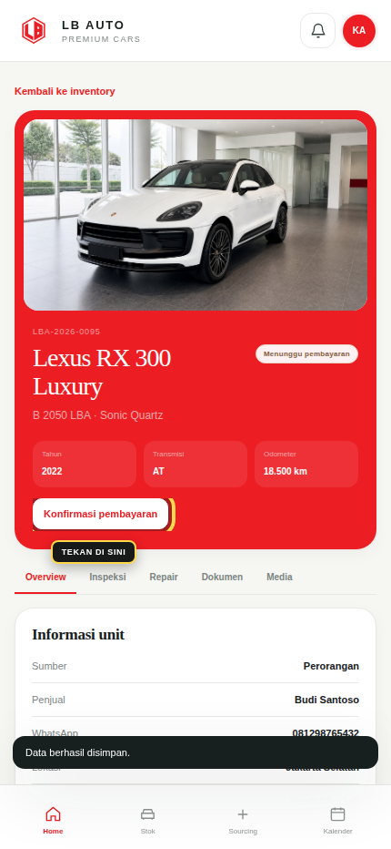

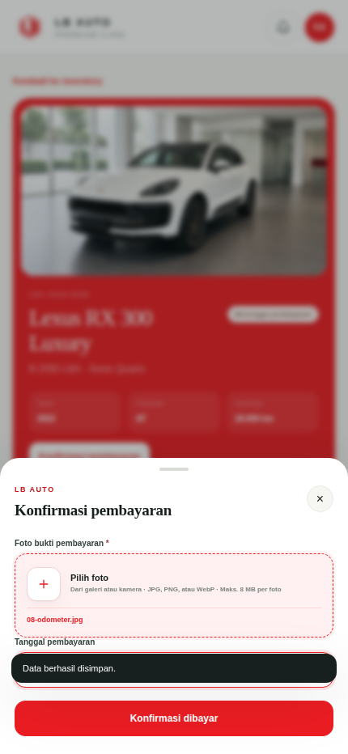

## 13. Tahap 8 — Serah-terima workshop

Dilakukan oleh **PIC Workshop**.

1. Buka menu **Workshop** dari Home atau sidebar.
2. Pilih unit berstatus **Sudah dibeli**.
3. Tekan **Terima unit**.
4. Isi odometer saat diterima.
5. Isi catatan kondisi fisik.
6. Konfirmasi penerimaan unit.

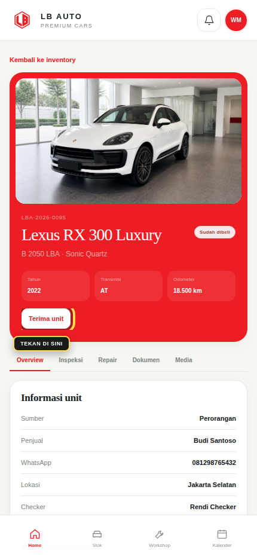

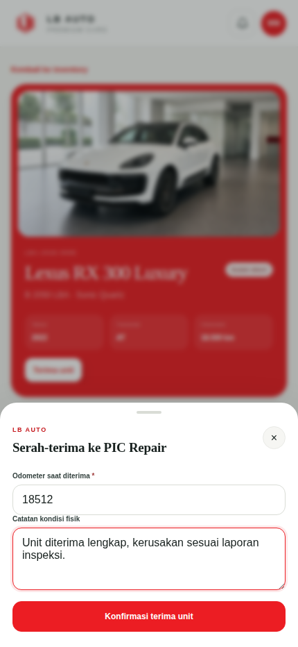

## 14. Tahap 9 — Pekerjaan repair

Dilakukan oleh **PIC Workshop**.

1. Buka unit yang sudah diserahterimakan.
2. Tekan **Update repair**.
3. Isi nama vendor atau workshop.
4. Pilih tahap pekerjaan.
5. Isi target selesai.
6. Catat setiap pekerjaan berdasarkan panel atau bagian kendaraan.
7. Isi progres dan biaya masing-masing pekerjaan.
8. Unggah foto before sebelum pekerjaan.
9. Unggah foto after setelah pekerjaan selesai.
10. Simpan progres.

Apabila seluruh pekerjaan mencapai 100 persen, foto before dan after harus sudah tersedia sebelum unit dapat diajukan untuk Repair QC.

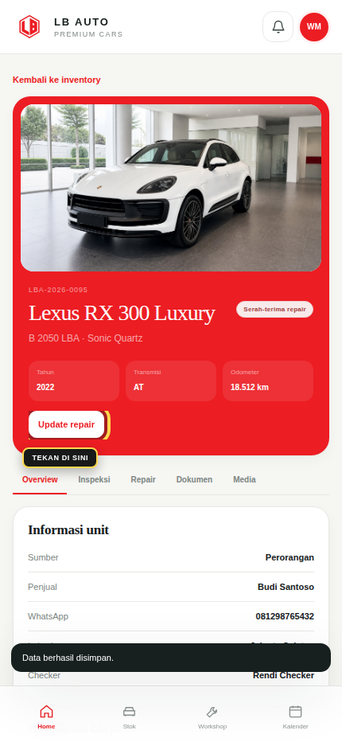


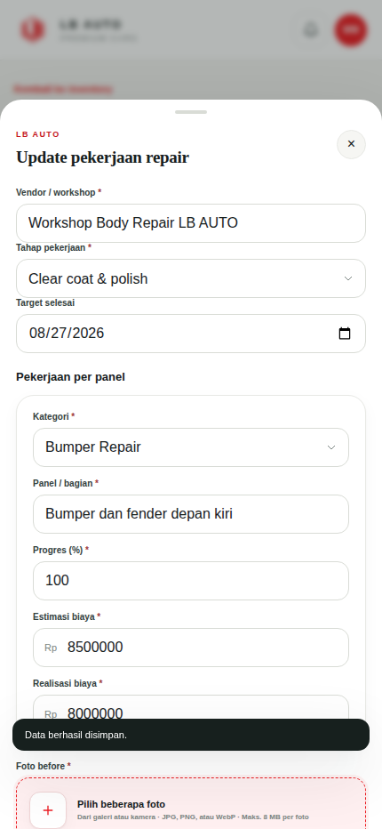

Foto yang tersimpan dapat diperiksa pada tab **Repair** di detail unit:

- **Kondisi sebelum repair** menampilkan seluruh foto before.
- **Hasil setelah repair** menampilkan seluruh foto after.
- Jumlah foto ditampilkan pada setiap kelompok.
- Tekan foto untuk membuka tampilan berukuran besar.

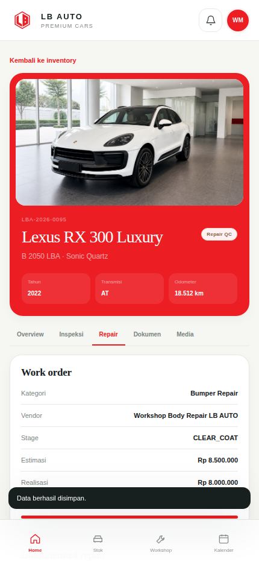

## 15. Tahap 10 — Repair QC

Dilakukan oleh **Head of Department**.

1. Buka unit berstatus **Repair QC**.
2. Periksa hasil pekerjaan dan foto before/after.
3. Tekan **Approval Repair QC**.
4. Pilih **Lulus QC** atau kembalikan ke workshop.
5. Isi catatan.
6. Simpan keputusan.

Jika lulus, unit diteruskan kepada PIC Legal untuk Document QC.

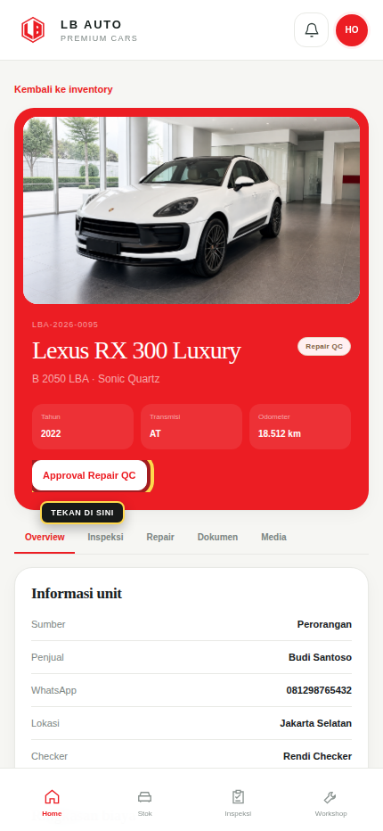

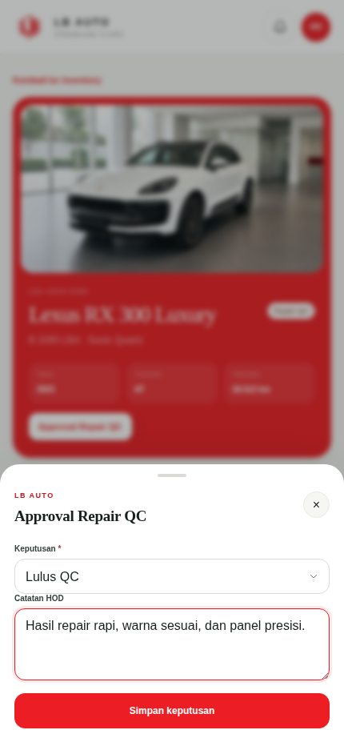

## 16. Tahap 11 — Document QC

Dilakukan oleh **PIC Legal**.

1. Buka unit berstatus **Document QC**.
2. Tekan **Document QC**.
3. Isi status STNK, BPKB, faktur, dan tanggal pajak.
4. Centang ketersediaan kwitansi bermaterai.
5. Centang ketersediaan fotokopi KTP pemilik.
6. Simpan dokumen.

Unit hanya dapat menjadi **Siap jual** apabila seluruh dokumen wajib sudah lengkap.

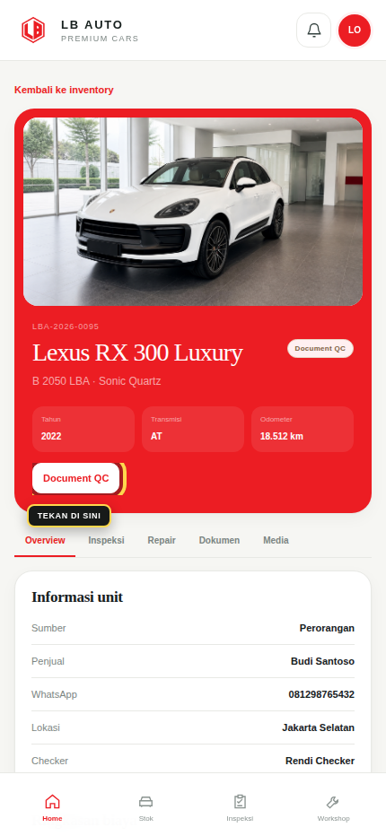

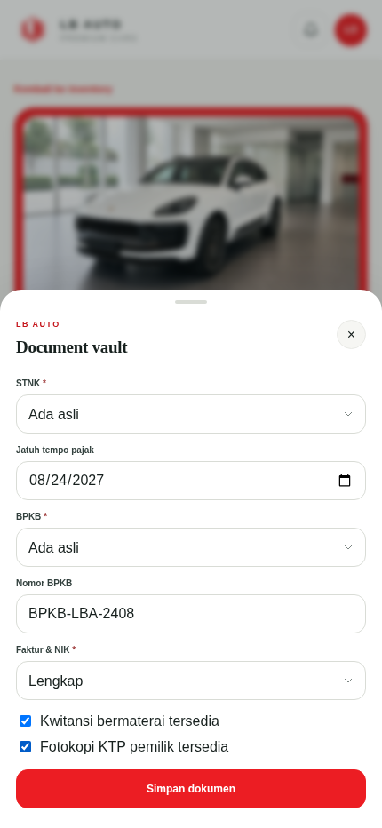

## 17. Tahap 12 — Membuat listing

Dilakukan oleh **Sales & Marketing**.

1. Buka unit berstatus **Siap jual**.
2. Tekan **Media & listing**.
3. Isi harga cash dan harga paket kredit.
4. Isi media, video, serta deskripsi iklan.
5. Pilih channel publikasi.
6. Pilih **Publikasikan sekarang**.
7. Simpan listing.

Pilihan channel berfungsi sebagai pencatatan administrasi. Tim tetap melakukan publikasi ke marketplace sesuai prosedur pemasaran yang berlaku.

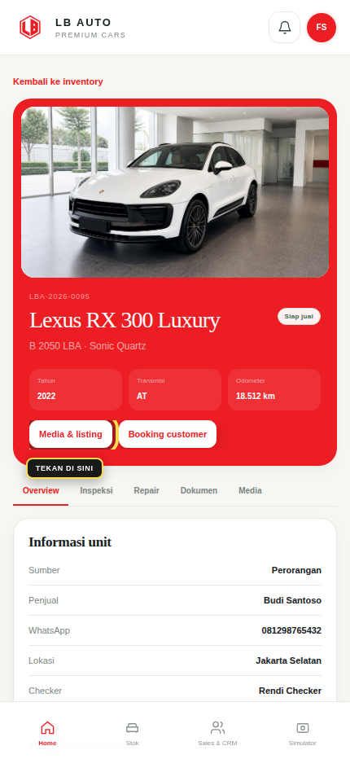

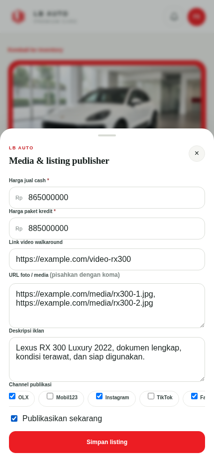

## 18. Tahap 13 — Booking customer

Dilakukan oleh **Sales & Marketing**.

1. Buka unit berstatus **Siap jual** atau **Published**.
2. Tekan **Booking customer**.
3. Isi data pembeli.
4. Pilih transaksi **Cash** atau **Credit**.
5. Isi harga jual final dan down payment.
6. Untuk kredit, isi vendor leasing dan tenor.
7. Simpan booking.

Booking belum berarti unit sudah selesai dijual atau diserahkan.

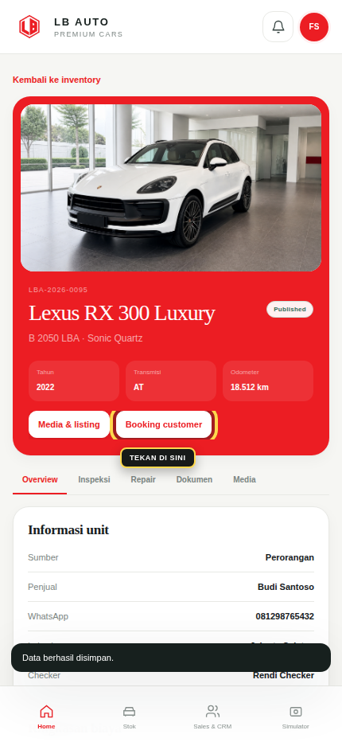

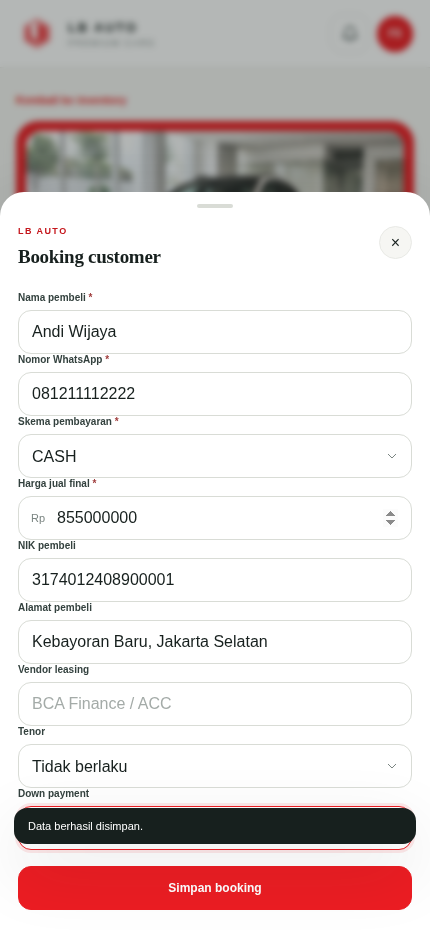

## 19. Tahap 14 — Proses cash atau kredit

### Transaksi cash

1. Buka unit berstatus **Booking**.
2. Tekan **Mulai pembayaran**.
3. Setelah pembayaran terkonfirmasi, tekan **Tandai deal**.

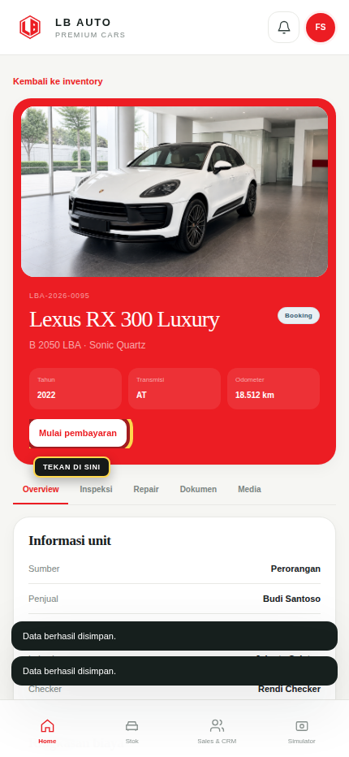

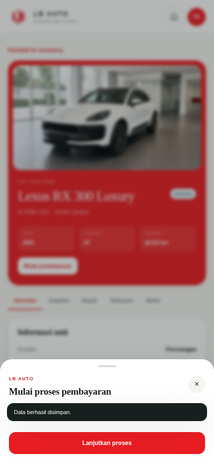

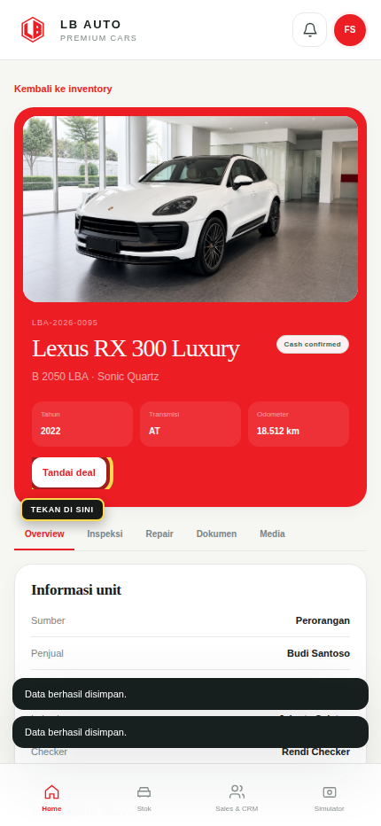

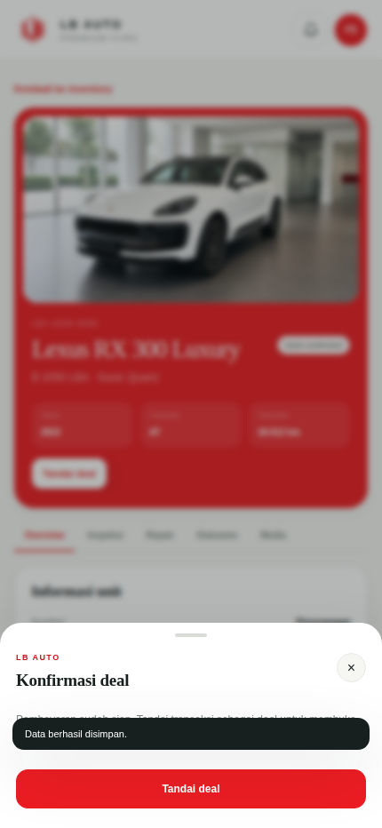

### Transaksi kredit

1. Buka unit berstatus **Booking**.
2. Tekan **Mulai pembayaran**.
3. Setelah survey selesai, tekan **Survey selesai**.
4. Setelah leasing memberikan hasil, tekan **Keputusan finance**.
5. Isi nomor referensi dan catatan leasing.
6. Jika disetujui, tekan **Tandai deal**.

Jika pengajuan kredit ditolak atau perlu direvisi, unit akan kembali ke tahap Booking untuk ditindaklanjuti.

## 20. Tahap 15 — Delivery

Dilakukan oleh **Sales & Marketing**.

### Menjadwalkan delivery

1. Buka unit berstatus **Deal**.
2. Tekan **Jadwalkan delivery**.
3. Isi tanggal, waktu, dan catatan penyerahan.
4. Simpan jadwal.

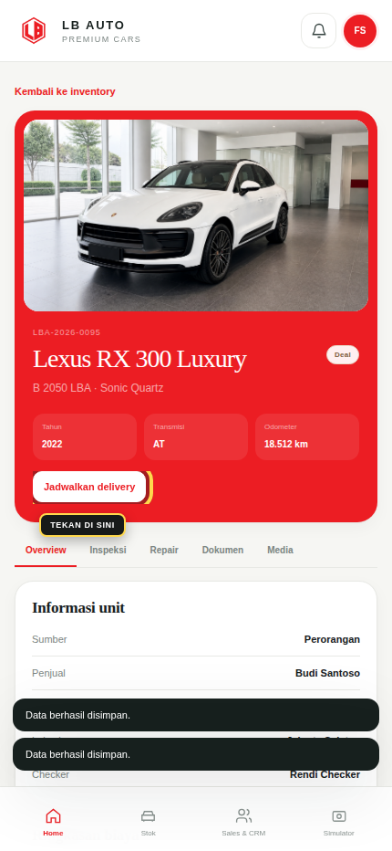

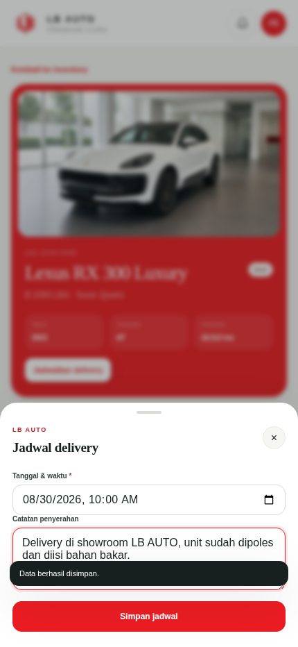

### Menyelesaikan delivery

1. Pastikan kendaraan benar-benar sudah diterima customer.
2. Buka unit berstatus **Delivery terjadwal**.
3. Tekan **Selesaikan delivery**.
4. Isi catatan penerimaan.
5. Konfirmasi bahwa unit telah diterima.

Jangan menyelesaikan delivery sebelum kendaraan benar-benar diserahkan kepada customer.

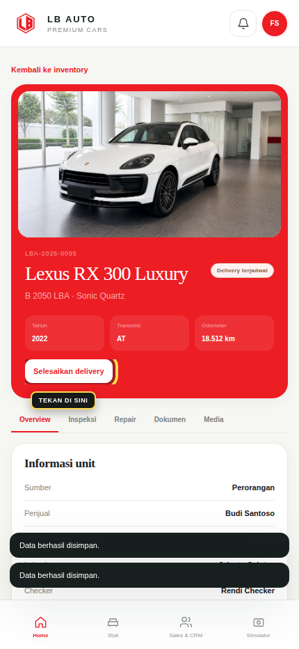

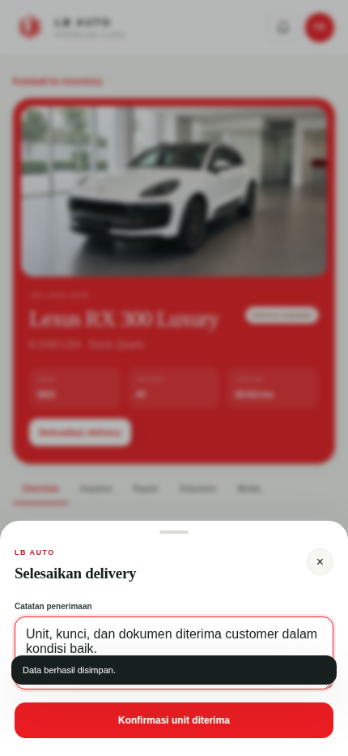

## 21. Dokumen transaksi dan greeting

Setelah delivery selesai, Sales & Marketing dapat:

- Membuka SPK.
- Membuka kwitansi.
- Membuka BASTK.
- Mencetak atau menyimpan dokumen melalui browser.

Untuk Delivery Greeting:

1. Tekan **Greeting**.
2. Pilih atau ambil foto customer.
3. Isi rating dan catatan.
4. Pastikan customer menyetujui penyimpanan serta publikasi media.
5. Centang persetujuan.
6. Simpan greeting.

Media greeting tidak dapat disimpan tanpa persetujuan customer.

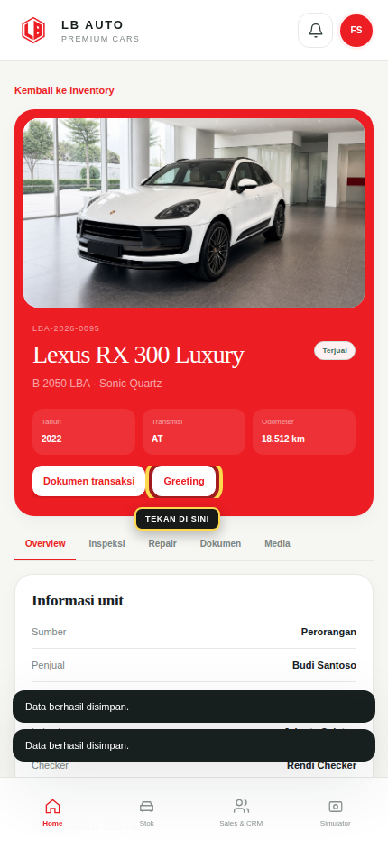

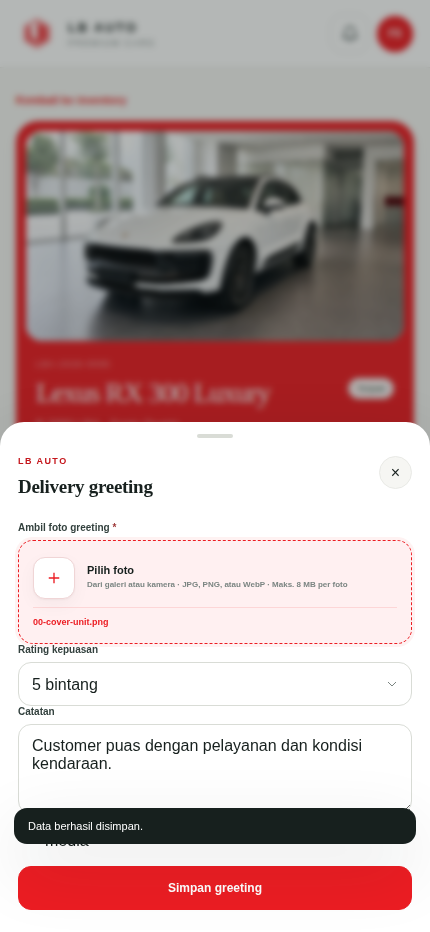

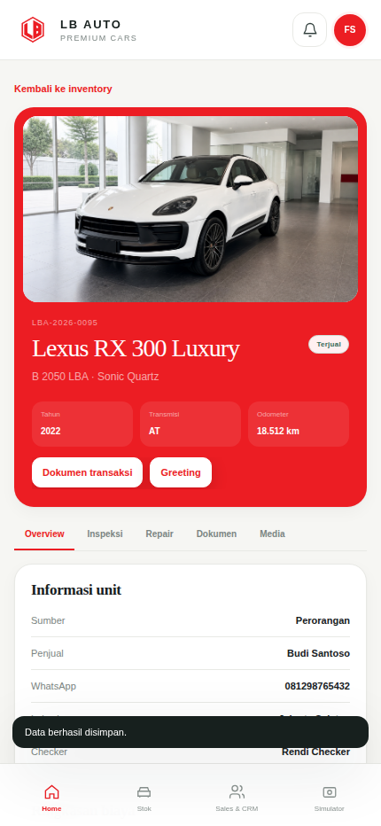

## 22. Sales & CRM

Sales & CRM digunakan untuk mencatat dan menindaklanjuti calon customer.

1. Buka **Sales & CRM**.
2. Tekan **Lead**.
3. Isi data calon customer dan unit yang diminati.
4. Simpan lead.
5. Gunakan tab untuk melihat lead berdasarkan tahap.
6. Tekan **Ubah status** setelah tindak lanjut dilakukan.
7. Pilih status tujuan yang diinginkan dan isi catatan tindak lanjut.
8. Tekan **Simpan perubahan**.

Status yang tersedia adalah **Lead baru**, **Follow up**, **Test drive**, **SPK terbit**, **Closed**, dan **Cancel**. Status dapat dipilih langsung tanpa harus bergerak satu per satu. Lead berstatus Closed atau Cancel juga dapat dibuka kembali dengan memilih status aktif yang sesuai.

Menutup lead tidak otomatis mengubah unit menjadi terjual; proses Booking dan Delivery tetap harus dijalankan.

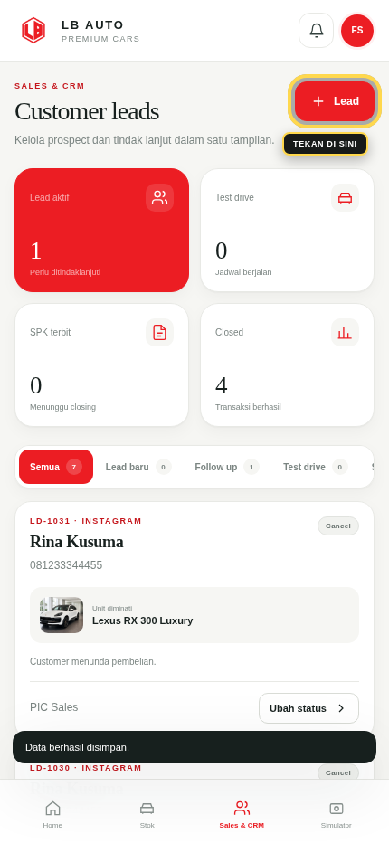

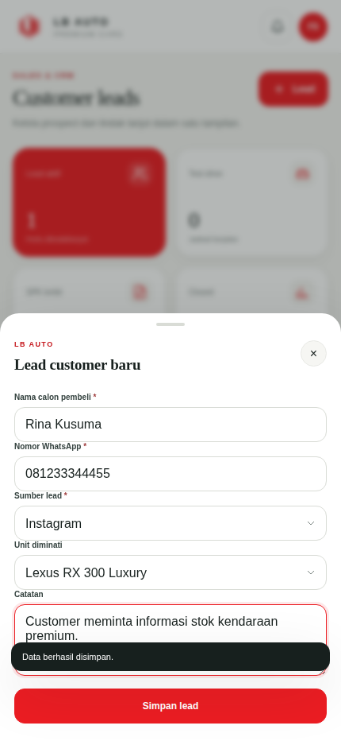

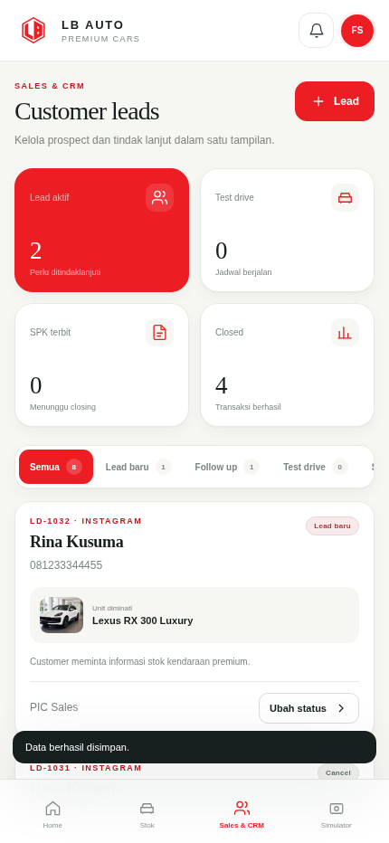


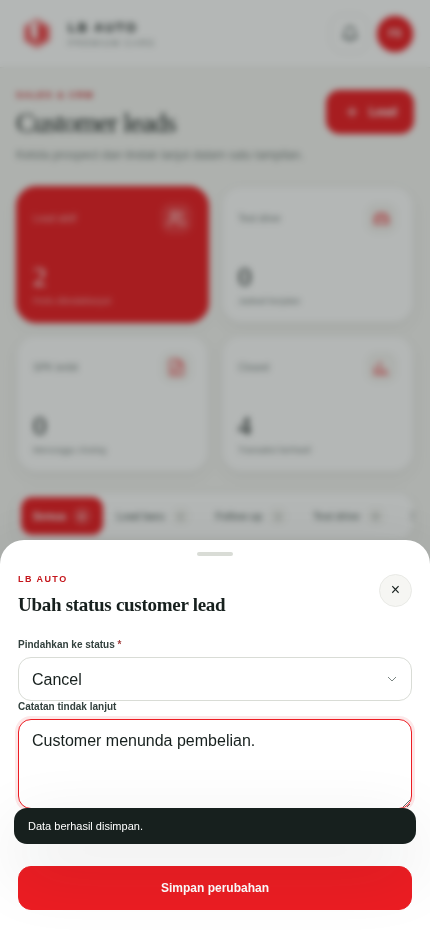

## 23. Notifikasi WhatsApp

Notifikasi WhatsApp membantu memberi tahu role berikutnya ketika ada proses yang memerlukan tindakan.

Contoh:

- PIC Legal diberi tahu ketika pemeriksaan legal diperlukan.
- HOD diberi tahu ketika keputusan pembelian diperlukan.
- PIC Pembelian diberi tahu ketika voucher atau pembayaran diperlukan.
- PIC Workshop diberi tahu ketika unit perlu diterima atau diperbaiki.
- Sales diberi tahu ketika unit siap dipasarkan.

Notifikasi hanya berfungsi jika administrator sudah mengatur nomor WhatsApp penerima.

## 24. Export laporan

Fitur ini digunakan oleh Owner untuk mengunduh perjalanan operasional seluruh unit.

1. Buka **Home**.
2. Pilih **Laporan** pada bagian Menu.
3. Pilih **Export PDF** atau **Export Excel**.
4. Tunggu sampai file selesai dibuat dan diunduh oleh browser.

**Export PDF** berisi satu halaman ringkasan, kemudian satu halaman khusus untuk setiap unit dari sourcing sampai delivery beserta foto yang tersedia. **Export Excel** membagi data ke beberapa sheet dan menyediakan tautan yang dapat ditekan untuk membuka foto.

File laporan dapat berisi data kendaraan, seller, customer, harga, dokumen, dan foto. Simpan serta bagikan file hanya kepada pihak yang berwenang.

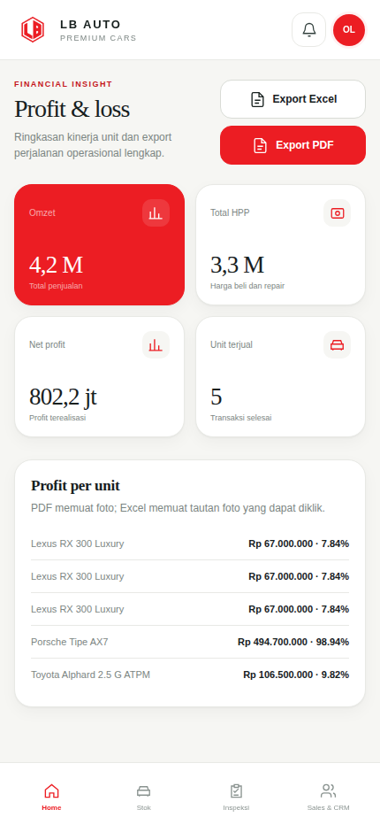

## 25. Keluar dari aplikasi

Pada mobile:

1. Tekan profil di pojok kanan atas.
2. Pilih **Logout**.

Pada desktop, Logout juga tersedia pada kartu profil di sidebar.

Selalu logout setelah menggunakan perangkat bersama.

## 26. Jika mengalami kendala

### Tombol tindakan tidak tersedia

Periksa apakah:

- Akun yang digunakan sudah sesuai dengan tugasnya.
- Status unit sudah berada pada tahap yang benar.
- Seluruh tahap prasyarat sudah selesai.

### Foto tidak dapat dipilih

Periksa apakah:

- Browser mempunyai izin untuk membuka foto atau kamera.
- File berformat JPG, PNG, atau WebP.
- Ukuran file tidak lebih dari 8 MB.
- Koneksi internet masih tersedia.

Pada mobile, tekan **Pilih foto** untuk membuka pilihan galeri, kamera, atau aplikasi file.

### Tampilan belum berubah

1. Tutup aplikasi atau seluruh tab LB AUTO.
2. Buka kembali aplikasi.
3. Jika masih sama, minta bantuan administrator.

### Proses unit tidak dapat dilanjutkan

Periksa status unit dan pastikan seluruh tugas prasyarat sudah diselesaikan oleh role terkait. Jika proses tetap tidak dapat dilanjutkan, hubungi administrator.

## 27. Checklist demo singkat

Gunakan urutan akun berikut untuk mendemonstrasikan satu unit dari awal hingga selesai:

1. PIC Pembelian: input unit dan foto cover.
2. Inspection Leader: Initial QC.
3. PIC Legal: pemeriksaan legal awal.
4. Inspection Leader: penugasan checker.
5. Field Checker: inspeksi dan delapan foto.
6. HOD: keputusan pembelian.
7. PIC Pembelian: voucher serta pembayaran.
8. PIC Workshop: serah-terima dan repair.
9. HOD: Repair QC.
10. PIC Legal: Document QC.
11. Sales & Marketing: listing dan booking.
12. Sales & Marketing: pembayaran, deal, dan delivery.
13. Sales & Marketing: dokumen transaksi serta greeting.

## 28. Catatan penting

- Gunakan foto dan data yang benar untuk kegiatan operasional sebenarnya.
- Jangan melompati tahapan meskipun tombol dapat diakses oleh Owner.
- Periksa kembali identitas kendaraan, nominal, dan dokumen sebelum memberikan approval.
- Pastikan customer memberikan persetujuan sebelum media greeting disimpan atau dipublikasikan.
